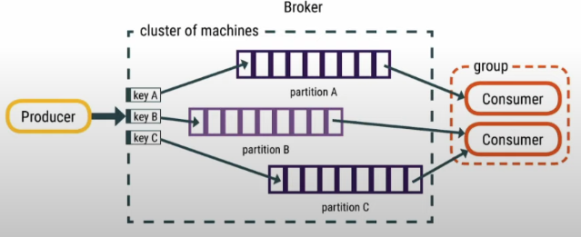

# kotlin-spring-kafka-example
* Exemplo de aplicação utilizando Kotlin com Spring, Kafka e Docker Compose aprendidos no canal Black Lab Tech. Link do vídeo:
  * https://youtu.be/7nMDJzao31c - Rodando Kafka com Docker
  * https://www.youtube.com/watch?v=8w_At1Krezc - Os 5 principais conceitos do Kafka (para iniciantes)
  * https://www.youtube.com/watch?v=DbkcOpWcMhU - Tutorial Completo de Kafka no Spring Boot com Schema Registry

# Anotações - Videos 1 e 2:
* Kafka é uma plataforma de streaming de eventos (PubSub/Mensageria) utilizada para realizar comunicação entre microserviços de maneira assíncrona.
  * Publicar através do Publisher.
  * Kafka armazena.
  * Consumidor processa/recebe.
* Principais conceitos:
* 
  * 1 - Evento (mensagem):
    * Composto por (exemplo): key (id ou cpf), value (dados cadastrados), timestamp (momento em que evento foi enviado) e header (duração, origem, *opcional).
  * 2 - Tópico:
    * Onde os eventos/mensagens são armazenados.
    * Particionado (no mínimo 1, no máximo qnd quisermos).
    * Ordenado (consome por ordem de chegada).
    * Fila durável (eventos persistentes). Diferente do RabbitMq, as msgs continuam no tópico durante um determinado periodo de tempo. Qnd criamos o tópico informamos a duração da mensagem. Só são apagadas qnd vencem.
  * 3 - Partições:
    * São as divisões do tópico.
    * Vantagens por escalabilidade (diferentes brokers, podem ficar em diferentes regiões).
    * Ordenação de consumo (key na mesma partição).
    * Máximo de 1 consumidor por partição (evita concorrência). Porém 1 consumidor pode consumir de mais de uma partição.
    * Necessário escalar quantidade de partições. Escalar de acordo com qntd de VM's.
  * 4 - Produtor:
    * Publicam os eventos do tópico. Essas mensagens são enviadas para as partições aleatoriamente, a não ser que já tenha alguma mensagem publicada com mesma key.
    * Não precisam conhecer o Consumidor (agnóstico).
    * Pode enviar msg ou lote (performance, acumula uma quantidade de mensagem e ai envia).
  * 5 - Consumidor:
    * Assinam, leem e processam os eventos/mensagens de um tópico.
    * Não conhecem o Produtor (agnóstico), apenas o tópico.
    * Offset & consumer group id, para sabermos onde paramos de consumir. Devido à fila ser durável, evitamos com offset de consumir mensagens duplicadas. Obs: RabbitMq consumiu, já apaga a mensagem.
    * Máximo de 1 consumidor por partição.
* Uma caracteristica interessante do Kafka, é que ele faz uma fila de mensagens que fica aguardando serem consumidas.
* Criado o docker-compose com 3 serviços:
  * zookeeper: Pré-requisito pra rodarmos o Kafka. Ele é responsável por criar e gerenciar tópicos, filas, conexões, etc.
  * kafka1: A PubSub.
  * kafdrop: Ferramenta de gerencimento do Kafka, para não precisarmos ficar enviando msg via terminal.

# Anotações - Tutorial Completo de Kafka no Spring Boot com Schema Registry:
* Schema Registry é uma tecnologia do Kafka para validar as mensagens que recebemos e enviamos.
* 
* Imagem acima sem Schema Registry:
  * Produtor envia mensagem pro Kafka diretamente. Consumer consome a mensagem diretamente, sem validações.
* Imagem acima com Schema Registry:
  * Produtor envia a mensagem (objeto avro) pra ser validada no Schema Registry. Se for válida, posta no Kafka. Consumidor envia o schema que tem pro Schema Registry, se der certo, pega a mensagam (objeto avro) do Kafka.
* O Schema Registry é uma API.
* Criando o projeto, a única dependência inicial que usaremos será a Spring for Apache Kafka.
* Adicionar as dependências:
  * kafka-avro-serializer: Serializa nosso objeto avro. Faz o contrário tbm.
  * avro: Transforma o schema em um objeto avro.
* Adicionar o repositório pra utilizar as dependências acima.
* Criamos o objeto Pessoa dentro de entity.
* E criamos o json do avro dentro da pasta Avro/PessoaDto.avsc.
* Detalhes sobre o schema: https://avro.apache.org/docs/1.11.1/getting-started-java/
* Inserido plugin do avro no pom pra gerar as classes java.
* Essa classe é gerada qnd o projeto é compilado, porém da pra forçarmos utilizando o Genereta Source and Update Folders do Maven.
* Classe gerada: [PessoaDTO.java](src%2Fmain%2Fkotlin%2Fbr%2Fcom%2Fgabrieldragone%2Fkotlinspringkafkaexample%2Fentity%2FPessoaDTO.java)
* Realizada a configuração do application.properties.
* Criação da ProducerConfig e da ProducerImpl para publicas as mensagens no tópico Pessoa.
* A parte do envio eu deixei no Controller, pra ficar mais fácil e não ter que ficar reiniciando a aplicação pra rodar.

# Rodando a aplicação:
* Rodar os containers do docker-compose através da IDE ou por comandos:
  * cd docker
  * docker-compose up
* Acessar: http://localhost:9000/
* 